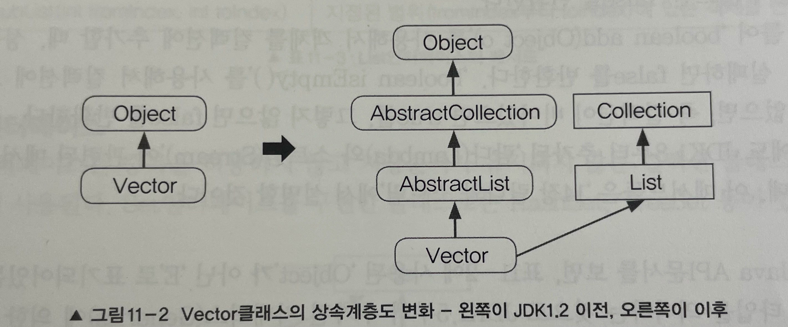

# 1. 컬렉션 프레임워웍(Collections Framework)
- 컬렉션 프레임웍 
  - 데이터 군(group)을 저장하는 클래스들을 표준화한 설계/단일화된 구조(architecture)
- 컬렉션 : 다수의 데이터, 즉 데이터 그룹
- 프레임웍 : 표준화된 프로그래밍 방식
- 다양하고 풍부한 클래스들을 제공한다.
- 인터페이스와 다형성을 이용한 객체지향적 설계를 통해 표준화되어 있다.
- 재사용성이 높은 코드를 작성할 수 있게 한다.

## 1-1 컬렉션 프레임웍의 핵심 인터페이스
- 컬렉션 프레임웍의 핵심 인터페이스 간의 상속 계층도는 아래와 같다.

                          Collection      
                           ⬆      ⬆       Map
                          List    Set

- `Vector`나 `Hashtable`과 같은 기존 컬렉션 클래스들 보다는 새로 추가된(JDK1.2 이후) `ArrayList`와 `HashMap`을 사용하는 것을 권장한다.
  <p align="center"></p>
### List 인터페이스
- 순서가 있는 데이터의 집합. 데이터의 중복을 허용한다. ex) 대기자 명단
- 구현 클래스 : `ArrayList` `LinkedList` `Stack` `Vector` 등
### Set 인터페이스
- 순서를 유지하지 않는 데이터의 집합, 데이터의 중복을 허용하지 않는다. ex) 양의 정수집합, 소수의 집합
- 구현 클래스 : `HashSet`, `TreeSet` 등 
### Map 
- 키(key)와 값(value)의 쌍(pair)으로 이루어진 데이터의 집합
- 순서는 유지되지 않으며, 키는 중복을 허용하지 않고, 값은 중복을 허용한다. ex) 우편번호, 지역번호(전화번호)
- 구현 클래스 : `HashMap` `TreeMap` `Hashtable` `LinkedHashMap` `SortedMap` `Properties` 등

- Map 인터페이스의 메서드

  | 메서드                                  | 설명                                                                |
  |---------------------------------------|:-------------------------------------------------------------------|
  |void clear()                           | Map의 모든 객체를 삭제한다.                                              |
  |boolean containsKey(Object key)        | 지정된 key객체와 일치하는 Map의 key객체가 있는지 확인한다.                      |
  |boolean containsValue(Object key)      | 지정된 value객체와 일치하는 Map의 value객체가 있는지 확인한다.                  |
  |Set entrySet()                         | Map에 저장되어 있는 key-value 쌍을 Map.Entry타입의 객체로 저장한 Set으로 반환한다.|
  |boolean equals (Object o)              | 동일한 Map인지 비교한다.                                                 |
  |Object get(Object key)                 | 지정한 key객체에 대응하는 value객체를 찾아서 반환한다.                          |
  |int hashCode()                         | 해시코드를 반환한다.                                                     |
  |boolean isEmpty()                      | Map이 비어있는지 확인한다.                                                |
  |Set keySet()                           | Map에 저장된 모든 key객체를 반환한다.                                       |
  |Object put (Object key, Object value)  | Map에 value객체를 key객체에 연결(mappng)하여 저장한다.                       |
  |void putAll (Map t)                    | 지정된 Map의 모든 key-value쌍을 추가한다.                                  |
  |Object remove (Object key)             | 지정한 key객체와 일치하는 key- value객체를 삭제한다.                          |
  |int size()                             | Map에 저장된 key -value쌍의 개수를 반환한다.                                |                       
  |Collection values()                    | Map에 저장된 모든 value객체를 반환한다.                                     |

### Map.Entity 인터페이스
- Map 인터페이스의 내부 인터페이스
- Map에 저장되는 key-value쌍을 다루기 위해 내부적으로 Entity인터페이스를 정의해 놓았다.
``` 
public interface Map {
    ...
  public static interface Entry {
        Object getKey();
        Object getValue();
        Object setValue(Object value);
        boolean equals(Object o);
        int hashCode();
        ...
      }
}
```
- Map.Entry인터페이스의 메서드

  | 메서드                            | 설명                       |
  |---------------------------------|:--------------------------|
  | boolean equals(Object o)        | 동일한 Entry인지 비교한다.      |
  | Object getKey()                 | Entry의 key객체를 반환한다.    |
  | int hashCode() | Entry의 해시코드를 반환한다.|
  | Object setValue(Object value) | Entry의 value객체를 지정된 객체로 바꾼다.|

### Collection 인터페이스
- Collection 인터페이스의 메서드들

  | 메서드                                                              | 설명                                                       |
  |------------------------------------------------------------------|:---------------------------------------------------------|
  | boolean add(Object o) <br/> boolean addAll(Collection c)         | 지정된 객체(o) 또는 Collection(c)의 객체들을 Collection에 추가한다.       |
  | void clear()                                                     | Collection의 모든 객체를 삭제한다.                                 |
  | boolean contains(Object o)<br/>boolean containsAll(Collection c) | 지정된 객체(o) 또는 Collection의 객체들이 Collection에 포함되어 있는지 확인한다. |
  | boolean equals(Object o)                                         | 동일한 Collection인지 비교한다.                                   |
  | int hashCode()                                                   | Collection의 hash code를 반환한다.                             |
