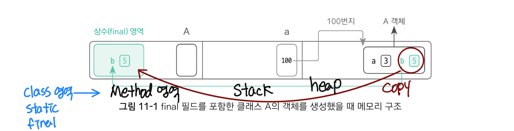
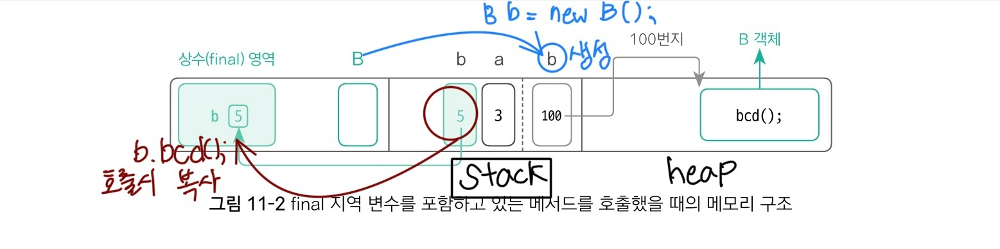

(Do it! 자바 완전 정복 11장 자바 제어자2)
## final 제어자
final 제어자는 필드, 지역 변수, 메서드, 클래스 앞에 위치할 수 있으며, 어디에 위치하느냐에 따라 의미가 다르다.

### final 변수
final 제어자는 변수를 선언할 때만 지정할 수 있으며, final 변수는 한 번 대입된 값을 수정할 수 없다. 즉, 한 번 대입된 값이 최종(final)값이 되는 셈이다.
```java
/**final 필드의 예*/
// 선언과 동시에 값을 대입했을 때
class A1 {
    int a = 3;
    final int b = 5;
    A1() {
    }
}
// 선언과 값의 대입을 분리했을 때. 이때 final 필드의 초기화는 반드시 생성자에서 진행한다.
class A2 {
    int a;
    final int b;
    A2() {
        a = 3;
        b = 5;
    }
}
// final 필드값을 대입한 후에는 추가 값 대입 불가능
class A3 {
    int a = 3;
    final int b = 3;
    A3() {
        a = 7;
        // b = 9;(불가능)
    }
    }
```
- final 필드는 일반 필드와 달리, 강제 초기화되지 않기 때문에 A2와 같이 선언과 값의 대입을 분리했을 때는 적어도 생성자에서는 값을 대입해야 한다.
```java
/**final 지역 변수의 예*/
class B {
    void bcd() {
        int a = 3;
        final int b = 5;
        a = 7;
        // b = 9;(불가능)
    }
}
```
- 같은 값이라도 값이 대입된 후에는 값을 입력하는 행위 자체를 할 수 없다.
```java
final int a = 3;
// a = 3;(불가능)
```
#### 메모리 구조
```java
class A {
    int a;
    final int b;
    A() {
        a = 3;
        b = 5;
    }
}
```
```java
A a = new A();
```
- 객체 생성시 final 필드는 final 영역에 복사된다.

```java
class B {
    void bcd() {
        int a = 3;
        final int b = 5;
    }
}
```
```java
B b = new B();
b.bcd();
```
- Stack 메모리에 final 지역변수 초기화시 final 영역에 복사


- 값이 들어가는 순간 처음 한번(선언되거나 호출되는 순간) 복사가 된다.
- 상수 영역으로 값이 복사 되는 순간 이후로 절대로 값을 바꿀 수 없다.
- 복사를 해야 하는 이유는? 
  - 메서드 안에서 선언된 변수는 메서드의 종료와 동시에 사라지게 된다. stack메모리에 메서드가 사라지고 난 후에도 여전히 변수를 사용해야 할 때가 있다. 
    - ex)이벤트 처리: "버튼 클릭 -> A를 출력해라" 라는 이벤트 핸들러 함수가 있을 때, A값을 지역변수로 선언한다면? 버튼을 눌러도 메서드는 사라지기 때문에 실행할 수 없다.
### final 메서드와 final 클래스
- final 메서드와 final 클래스도 각각 최종 메서드, 최종 클래스의 의미를 지닌다.
#### final 메서드
- 메서드를 final로 정의하면 자식 클래스에서 해당 메서드를 오버라이딩 할 수 없다.
```java
class A {
    void abc() {
    }
    final void bcd() {
    }
}
class B extends A {
    void abc() {
    }
    // void bcd() {} ->  불가능
}
```
#### final 클래스
- final 클래스는 상속 자체가 아예 불가능하다.
```java
final class A {
    // ...
}
// class B extends A {} -> (불가능)
```
- String 클래스도 final 클래스로 정의돼 있으므로 String 클래스를 상속받아 자식 클래스를 생성할 수 없다.

### 정리
- final 변수: 값 변경 불가능
- final 메서드: 오버라이딩 불가능
- final 클래스: 상속 불가능