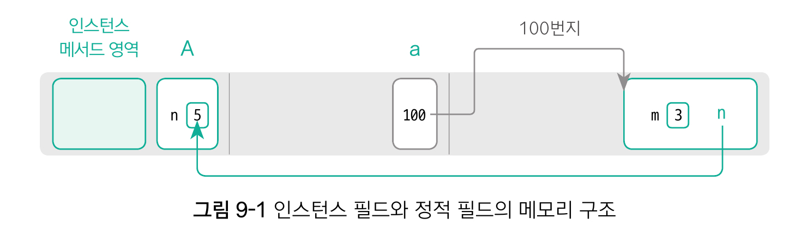
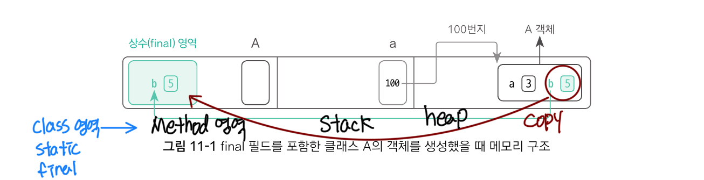
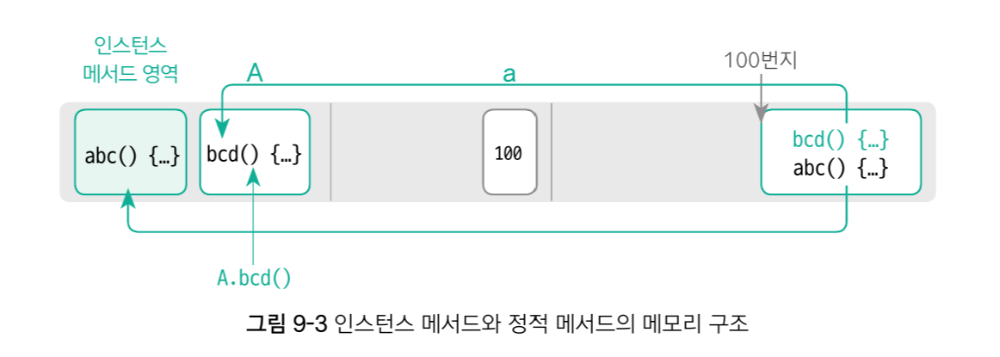

(DO it! 자바 완전 정복, 이것이 자바다)
- static: 클래스의 멤버(필드, 메서드, 이너 클래스)에 사용하는 제어자
- 인스턴스 멤버(instance member): 객체 안에 있을 때 사용할 수 있는 상태가 되는 멤버
- 정적 멤버(static member): 클래스.멤버명만으로도 바로 사용할 수 있다.
  - 메소드 영역의 클래스에 고정적으로 위치하는 멤버
  - 객체마다 가지고 있을 필요성이 없는 공용적인 필드는 정적 필드로 선언하는 것이 좋다.(ex. 파이값)
  - 인스턴스 필드를 이용하지 않는 메소드는 정적 메소드로 선언하는 것이 좋다.
- 클래스명.멤버명의 형태로 사용

## 인스턴스 필드와 정적 필드
- 각 필드의 저장 위치

- 활용 방법
```java
    class A {
        int m = 3;         // 인스턴스 필드
        static int n = 5;  // 정적 필드
    }
    
    public class StaticField_1 {
        public class void main(String[] args){
            // 인스턴스 필드 활용 방법(객체를 생성한 후 사용 가능)
            A a1 = new A();
            System.out.prntln(a1.m);
            
            // 정적 필드 활용 방법
            // 1. 객체 생성 없이 클래스명으로 바로 활용
            System.out.println(A.n);
            // 2. 객체를 생성한 후 활용(권장하지 않음)
            A a2 = new A();
            System.out.println(a2.n);
        }
    }
```

### '정적 필드는 객체 간 공유 변수의 성질이 있다.'

```java
A a1 = new A();
A a2 = new A();

a1.m = 5;                  // a1 객체의 인스턴스 필드 m에 값 5 입력
a2.m = 6;                  // a2 객체의 인스턴스 필드 m에 값 6 입력
System.out.println(a1.m);  // 5
System.out.println(a2.m);  // 6

a1.n = 7;                  // a1 객체의 정적 필드 n에 값 7 입력
a1.n = 8;                  // a2 객체의 정적 필드 n에 값 8 입력
System.out.println(a1.n);  // 8
System.out.println(a2.n);   // 8

A.n = 9;                    // 클래스 A의 정적 필드 n에 값 9 입력
System.out.println(a1.n);   // 9
System.out.println(a2.n);   // 9
```

## 인스턴스 메서드와 정적 메서드
- 인스터드 메서드 : 객체를 생성한 후에 사용
- 정적 메서드 : 클래스명으로 바로 접근하거나 객체로 호출, 객체 없이 사용 가능
```java
class A {
    void abc() {
        System.out.println("instance 메서드");
    }
    static void bcd() {
        Systme.out.println("static 메서드")
    }
}
```

### 인스턴스 필드와 정적 필드의 다른 점
- 인스턴스 메서드와 정적 메서드는 모두 메모리의 첫 번째 영역에 위치한다.
- 차이점 : 인스턴스 메서드는 인스턴스 메서드 영역, 정적 메서드는 클래스 내부에 존재한다.


### 정적 메서드 안에서 사용할 수 있는 필드와 메서드
- 정적 메서드 내에서는 정적 메서드만 사용할 수 있다.
- 정적 멤버(정적 필드, 정적 메서드)는 객체의 생성 없이 실행될 수 있어야 한다.
  - 인스턴스 멤버(인스턴스 필드, 인스턴스 메서드)는 반드시 객체를 생성한 후에 사용할 수 있다.
- 정적 메서드 내부에서는 클래스 내부에서 자신의 객체를 가리키는 this 키워드를 사용할 수 없다.
  this : 정적 메서드 내부에서는 클래스 내부에서 자신의 객체를 가리키는 this 키워드를 사용할 수 없다.
  this.가 자동으로 붙어야 하는 인스턴스 멤버는 올 수 없다.
- 인스턴스 메서드 내에서는 인스턴스 멤버와 정적 멤버 모두 사용할 수 있다.

```java
class A {
  int a;       // -> 객체를 생성한 후 사용 가능
  static int b;    
  void abc() {           // -> 객체를 생성한 후 사용 가능
      // a, b, bcd(), cde() 사용 가능 
  }
  static void bcd(){
      // b, cde() 사용 가능
  }
  static void cde() {
      // b, bcd () 사용 가능
  }
  
  }
```

### 정적 초기화 블록
- 인스턴스의 초기화 -> 객체가 만들어지는 시점, 즉, 생성자 내에서 인스턴스 필드를 초기화 한다.
- 정적 필드 -> 객체의 생성 이전에도 사용할 수 있어야 함, 생성자에서는 정적 필드를 초기화할 수 없다.

```java
class A{
    int a;
    static int b;

  static {
    b = 5;
    System.out.println("클래스가 메모리에 로딩될 때 static block 실행")
  }
  A() {
      a = 3;  // 인스턴스 필드의 초기화 위치
  }
}
public class StaticInitialBlock {
    public static void main(String[] args) {
        System.out.println(A.b);         
        //A.b가 실행되는 시점에 클래스 A가 메모리에 로딩되며, 이때 static {} 초기화 블록이 실행됨
    }
}

```
- 정적 초기화 블록은 클래스가 메모리에 로딩될 때 가장 먼저 실행됨. 
- 초기화 코드를 넣어 두면 클래스가 로딩되는 시점에 바로 초기화 할 수 있다.

### static main() 메서드
```java
public static void main(String[] args )
```
- main() 메서드는 왜 정적 메서드로 구성됐을까?
  - 자바 가상 머신(JVM)이 main() 메서드를 실행시켜 주기 때문에 가장 먼저 실행됨
  - 실행 클래스명.main()으로 실행한다. (객체를 생성하지 않는다.)
  - 자바 가상 머신이 main()메서드를 실행하는 순서는 아래와 같다.

         A.java ➡️➡️  A.class ➡️➡️ JVM ➡️➡️ A.main() 실행
                컴파일       실행      