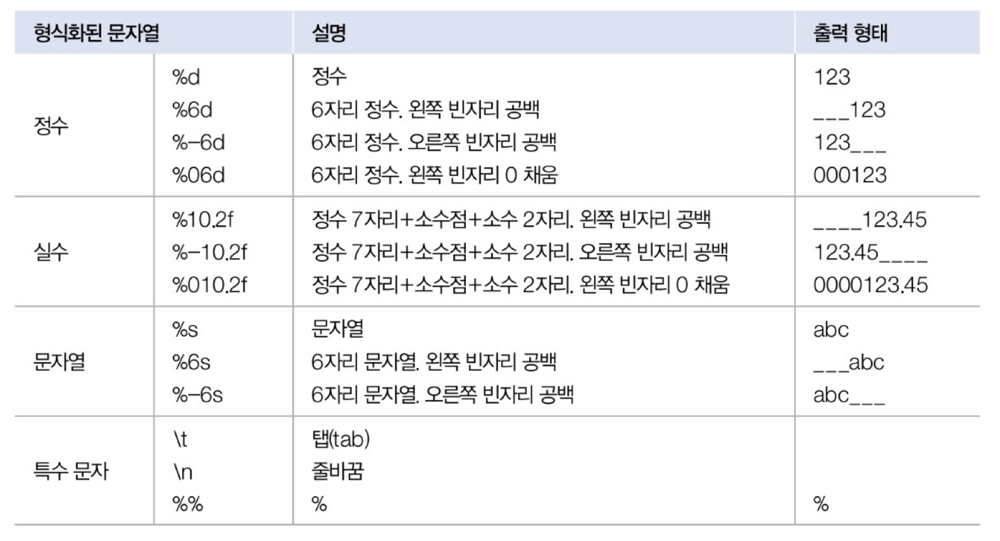

(이것이 자바다 ch2 변수와 타입)
## 변수와 타입
- 변수 선언: 저장되는 값의 타입과 이름을 정하는 것

```java
// (타입) (이름)
int age;            // 정수(int) 값을 저장할 수 있는 age 변수 선언
double value;       // 실수(double) 값을 저장할 수 있는 value 변수 선언
```
변수 초기화: 변수에 최초로 값이 대입될 때 메모리에 할당되고, 해당 메모리 값에 저장된다.

### 기본(primitive) 타입 8개

|     값의 분류      | 기본 타입                         |
|:--------------:|-------------------------------|
|       정수       | byte, short, char,  int, long |
|       실수       | float, double                 |
| 논리(true/false) | boolean                       |

#### 문자 타입
- 문자 리터럴: 하나의 작은 따옴표(')로 감싼 것, 유니코드로 변환되어 저장된다.
- 유니코드: 0~65535 숫자로 매핑한 국제 표준 규약 (char 타입으로 저장)

#### 실수 타입 : float, double

| 타입     | 메모리 크기       | 
|--------|--------------|
| float  | 4byte/ 32bit |
| double | 8byte/ 64bit |

- double 타입이 float 타입보다 큰 실수를 저장할 수 있고 정밀도 또한 높다.

### 자동 타입 변환(promotion)
- 값의 허용 범위가 작은 타입이 허용 범위가 큰 타입으로 대입될 때 발생한다.

                                       자동 타입 변환
                                            ⬅ 
                              큰 허용 범위 타입 = 작은 허용 범위 타입

``` 
byte < short, char < int < long < float < double
```

```java
byte byteValue=10;
        int intValue=byteValue; // 자동 타입 변환됨

        char charValue='A';
        int intValue=charValue; // 65가 저장됨
```

- (예외) char 타입보다 허용 범위가 작은 byte 타입은 char 타입으로 자동 변환이 될 수 없다. (char타입과 달리 byte타입은 음수를 포함하기 때문)

```java
byte byteValue=65;
char charValue=byteValue;   // 컴파일 에러
```

### 강제 타입 변환

                                  강제 타입 변환
                                       ⬅ 
                        작은 허용 범위 타입 = (작은 허용 범위 타입)큰 허용 범위 타입

#### int ➡️ byte
  - 128 ~ 127인 int 값만 원래 값을 보존할 수 있다.

```java
int intValue=10;
byte byteValue=(byte)intValue;   // 강제 타입 변환
```

#### long ➡️ int
```java
long longValue=300;
        int intValue=(int)longValue; // 강제 타입 변환 후에 300이 그대로 유지
```

#### int ➡️ char
- 0~65535(char타입의 허용 범위)사이의 값만 원래 값을 유지한다.

```java
int intValue=65;
        char charValue=(char)intValue;
        System.out.println(charValue); // 'A'가 출력
``` 

#### 실수 ➡️ 정수
- 소수점 이하 부분은 버려지고 정수 부분만 저장된다.

```java
double doubleValue=3.14;
        int intValue=(int)doubleValue // intValue는 정수 부분인 3만 저장
```

### 연산식에서 자동 타입 변환
#### 정수 연산
- 정수 연산에서 변수가 사용될 경우에는 int 타입으로 변수를 선언하는 것이 타입 변환이 발생하지 않기 때문에 실행 성능에 도움이 된다.
```java
int result=[byte,char,short,int 타입]연산자(+,-,*,/,%)[byte,char,short,int 타입]
```
#### 실수 연산
- 피연산자 중 하나가 double 타입이면 다른 연산자도 double 타입으로 변환되어 연산되고, 연산 결과 또한 double 타입이 된다.

```java
long result=[long 타입]연산자(+,-,*,/,%)[byte,char,short,int 타입]
```
- 만약 double 타입을 int 타입으로 연산을 해야 한다면 int 타입으로 강제 변환하고 덧셈 연산을 수행하면 된다.
```java
int intValue=10;
        double doubleValue=5.5;
        int result=intValue+(int)doubleValue;  // 10 + 5
```
- 자바에서 정수 연산의 결과는 항상 정수가 된다.

```java
int x=1;
        int y=2;
        double result=x/y;
        System.out.println(result); // 0.5가 아니라 0.0이 출력된다.
```

- 원하는 결과인 0.5를 얻으려면 x와 y중 하나 이상을 double 타입으로 변환한다.

```java
int x=1;
        int y=2;
        double result1=(double)x/y;         // 0.5
        double result2=x/(double)y;         // 0.5
        double result3=(double)x/(double)y;  // 0.5

        double result4=(double)(x/y)          // 0.0  -> (x / y)가 먼저 연산이 되어 0이 되고, 
// 그 후 double 타입으로 변환함.
```

- 자바에서 + 연산자는, ```1. 덧셈 연산 수행``` ```2. 피연산자 중 하나가 문자열이면 문자열 결합 연산```을 수행한다. +연산은 앞에서부터 순차적으로 연산을 수행한다.

```java
String str="3"+7;  ➡️  String str="3"+"7";  ➡️  String str="37";
        String str=1+2+"3";  ➡️  String str=3+"3";  ➡️  String str="33";
        String str=1+"2"+3;  ➡️  String str="12"+3;  ➡️  String str="123";
        String str="1"+(2+3);  ➡️  String str="1"+5;  ➡️  String str="15";   
```

### 문자열을 기본 타입으로 변환

| 변환 타입              | 사용 예                                                                 |
|--------------------|----------------------------------------------------------------------|
| String ➡️ int      | String str = "300000";<br/> int value = Integer.parseInt(str);       |
| String  ➡️ long    | String str = "40000000000";<br/> long value = Long.parseLong(str);   |
| String  ➡️ double  | String str = "12.345";<br/> double value = Double.parseDouble(str);  |
| String  ➡️ boolean | String str = "true";<br/> boolean value = Boolean.parseBoolean(str); |

### 기본 타입의 값을 문자열로 변경

```
String str = String.valueOf(기본타입값);
```

### 콘솔로 변수값 출력

| 메소드                           | 의미                               |
|-------------------------------|------------------------------------|
| println(내용)                   | 괄호 안의 내용을 출력하고 행을 바꿔라.       |
| print(내용)                     | 괄호 안의 내용을 출력하고 행은 바꾸지 말아라.   |
| printf("형식문자열", 값1, 값2, ...); | 형식 문자열에 맞추어 뒤의 값을 출력해라.     |

```
printf("형식문자열", 값1, 값2,....)
형식 문자열 ➡ % [argument_index$] [flags] [width] [.precision] conversation
               (값의 순번)        -,0    전체 자릿수   소수 자릿수     변환 문자(생락불가능)
```

- flags: 빈 공백을 채운다. 생략되면 왼쪽이, -가 오면 오른쪽이 공백으로 채워진다. 0은 공백 대신 0으로 채운다.
- width: 소숫점을 포함한 전체 자릿수
- .precision: 소수 이하 자릿수
- conversation: d(정수), f(실수), s(문자열)

```java
System.out.printf("이름: %s", "김자바");    ➡ 이름: 김자바
System.out.printf("나이: %d", 25);        ➡ 나이: 25
```



